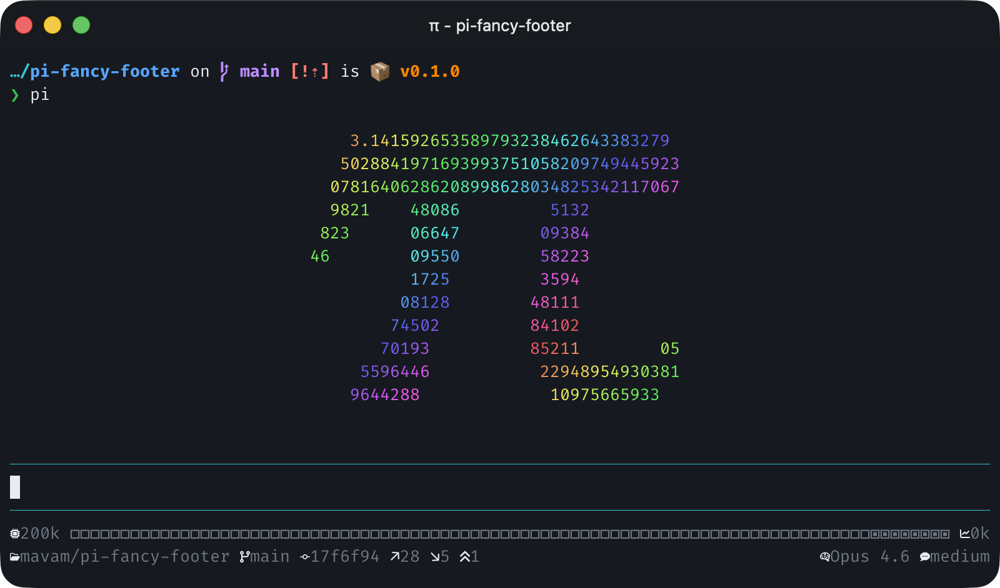
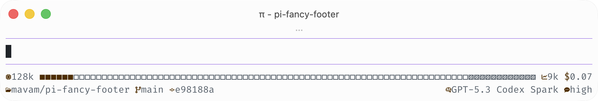
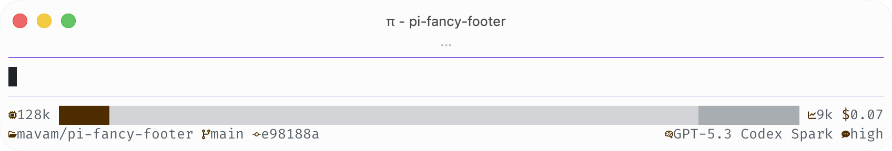
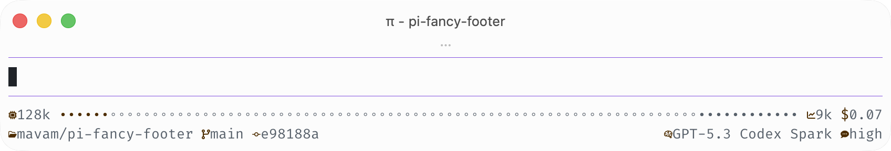
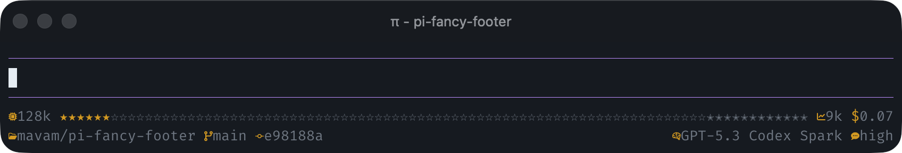
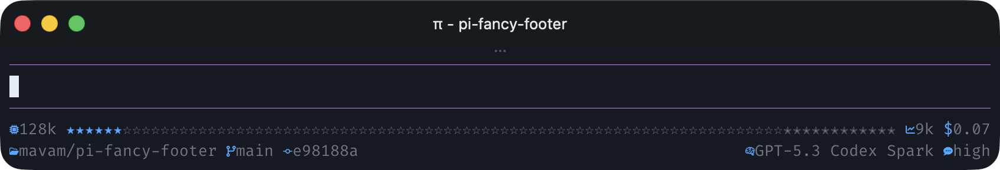
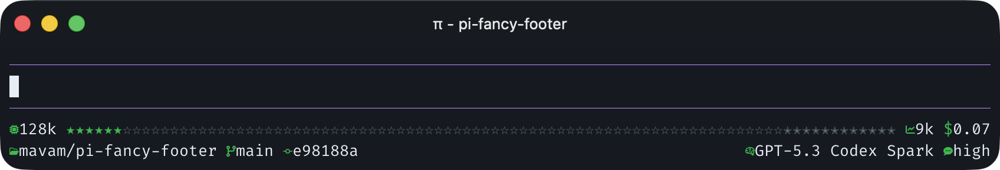
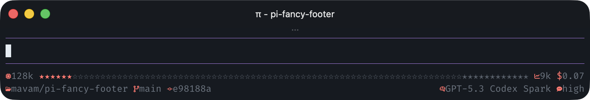

# ✨ pi-fancy-footer

A [pi](https://github.com/badlogic/pi-mono/tree/main/packages/coding-agent)
extension that replaces the default footer with a compact, two-line fancy status
footer.



## 📦 Install

```bash
pi install npm:pi-fancy-footer
```

## 📊 What it shows

- Active model + thinking level
- Provider quota status for OpenAI Codex
- Context window capacity and approximate usage
- Context usage bar with compaction reserve tail
- Total session cost
- Repo / path, branch, commit, open PR number, unresolved PR review
  threads, and PR CI status
- Git diff stats and ahead/behind status

## 📸 Screenshots

> [!NOTE]
> Some screenshots include `pi-banner`, which is now a separate extension.

<!-- markdownlint-disable MD033 -->

<br/>
<br/>
<br/>


<br/>
<br/>
<br/>


<!-- markdownlint-enable MD033 -->

## 🎮 Commands

- `/fancy-footer` - open interactive footer config editor (small TUI)
  - settings are grouped into General, Built-in widgets, and Extension widgets sections
  - built-in and 3rd-party widgets are listed directly (with icon prefixes)
  - select a widget and press Enter for detailed settings
  - in widget settings, adjust row/position/align/fill/min-width, visibility,
    icon hide, icon color, and text color
  - use Enter/Space to cycle values

## ⚙️ Configuration

Create `~/.pi/agent/fancy-footer.json`:

```json
{
  "refreshMs": 3000,
  "iconFamily": "unicode",
  "contextBarStyle": "blocks",
  "defaultTextColor": "dim",
  "defaultIconColor": "text",
  "providerStatus": {
    "refreshMs": 60000,
    "cacheTtlMs": 60000,
    "providers": ["openai-codex"],
    "showCredits": false,
    "showReset": false
  },
  "widgets": {
    "context-bar": {
      "align": "middle",
      "row": 0,
      "position": 0,
      "fill": "grow",
      "minWidth": 12
    },
    "total-cost": {
      "enabled": false
    },
    "branch": {
      "icon": "hide",
      "textColor": "muted"
    }
  },
  "extensionWidgets": {
    "acme.build-status": {
      "row": 1,
      "position": 8,
      "align": "right"
    }
  }
}
```

Top-level settings:

> [!NOTE]
> `fancy-footer.json` is validated strictly. Use only the documented keys and values.
> Invalid config falls back to defaults and logs a warning.

- `refreshMs` (number)
- `iconFamily`
  (`nerd` | `emoji` | `unicode` | `ascii`)
- `contextBarStyle`
  (`blocks` | `lines` | `circles` | `parallelograms` | `diamonds` | `bars` |
  `stars` | `specks`)
- `defaultTextColor`
  (`text` | `accent` | `muted` | `dim` | `success` | `error` | `warning`)
- `defaultIconColor`
  (`text` | `accent` | `muted` | `dim` | `success` | `error` | `warning`)
- `providerStatus`:
  - `refreshMs` - provider status refresh interval in milliseconds
  - `cacheTtlMs` - cache freshness window in milliseconds
  - `providers` - supported provider adapters (`openai-codex`)
  - `showCredits` - include provider-specific credit balance when available
  - `showReset` - include the primary reset time when available

Supported per-widget overrides for both `widgets` and `extensionWidgets`:

- `enabled` (boolean)
- `row` (number)
- `position` (number, ordering within an aligned row group)
- `align` (`left` | `middle` | `right`)
- `fill` (`none` | `grow`)
- `minWidth` (number)
- `icon` (`default` | `hide`)
- `iconColor`
  (`text` | `accent` | `muted` | `dim` | `success` | `error` | `warning`)
- `textColor`
  (`text` | `accent` | `muted` | `dim` | `success` | `error` | `warning`)

Built-in widget IDs:

- `model`
- `thinking`
- `context-capacity`
- `context-bar`
- `context-usage`
- `total-cost`
- `location`
- `branch`
- `commit`
- `pull-request`
- `pull-request-review-threads`
- `pull-request-ci-status`
- `provider-status`
- `diff-added`
- `diff-removed`
- `git-status`

3rd-party widget IDs are extension-defined and live under `extensionWidgets`.

## 🧩 Extension widgets

Other pi extensions can contribute fancy-footer widgets.

### For users

- Contributed widgets appear in a separate **Extension widgets** section in `/fancy-footer`.
- Their overrides are stored in `extensionWidgets` inside `~/.pi/agent/fancy-footer.json`.
- They use the same layout controls as built-in widgets, so you can mix and match them on any footer row.

### For extension developers

If your extension depends on `pi-fancy-footer`, import the helper API from `pi-fancy-footer/api`:

```ts
import type { ExtensionAPI } from "@mariozechner/pi-coding-agent";
import { contributeFancyFooterWidgets } from "pi-fancy-footer/api";

export default function (pi: ExtensionAPI) {
  contributeFancyFooterWidgets(pi, {
    id: "acme.build-status",
    label: "Build status",
    icon: {
      nerd: "󰙨",
      emoji: "🧪",
      unicode: "◈",
      ascii: "B",
    },
    row: 1,
    order: 8,
    align: "right",
    render: () => "passing",
  });
}
```

Available helpers:

- `defineFancyFooterWidget(widget)` - identity helper for typing widget definitions.
- `contributeFancyFooterWidgets(pi, widgetOrWidgets)` - register one or more widgets for discovery.
- `requestFancyFooterWidgetDiscovery(pi)` - ask `pi-fancy-footer` to re-discover contributed widgets.
- `requestFancyFooterRefresh(pi)` - ask the footer to re-render immediately.

Each contributed widget defines:

- `id` - stable config key, ideally namespaced like `vendor.widget-name`
- `render(ctx, availableWidth?)` - widget renderer; return `undefined`, `null`, `false`, or an empty string to hide the widget
- `label` - display name in `/fancy-footer` (defaults to `id`)
- `description` - help text in the config UI (defaults to `label`/`id`)
- `row`, `order`, `align`, `grow`, and `minWidth` - optional default layout controls
- `icon` - a single icon, per-family icon map, function, or `false`
- optional `textColor` and `styled`

## 🔣 Icon families

The following table shows the symbol used by each widget for each icon family.
For `git-status`, the table shows the rendered status symbols rather than a
leading widget icon.

> [!NOTE]
> Some glyphs, especially in the `nerd` family, may not render in your browser.
> If a cell looks blank or shows a replacement box, check the table in a
> terminal with the relevant font installed.

<!-- markdownlint-disable MD013 MD060 -->

| Widget                        | nerd    | emoji      | unicode | ascii    |
| ----------------------------- | ------- | ---------- | ------- | -------- |
| `model`                       | `󰚩`     | `🤖`       | `◉`     | `%`      |
| `thinking`                    | `󰧑`     | `🧠`       | `✦`     | `?`      |
| `context-capacity`            | ``     | `💾`       | `□`     | `[]`     |
| `context-bar`                 | `󰾆`     | `🔋`       | `◧`     | `\|`     |
| `context-usage`               | ``     | `📈`       | `■`     | `~`      |
| `total-cost`                  | `󰇁`     | `💲`       | `$`     | `$`      |
| `location`                    | ``     | `📁`       | `⌂`     | `/`      |
| `branch`                      | ``     | `🌿`       | `⎇`     | `*`      |
| `commit`                      | ``     | `🔖`       | `#`     | `#`      |
| `pull-request`                | ``     | `🔀`       | `⇄`     | `@`      |
| `pull-request-review-threads` | `󰅺`     | `💬`       | `✎`     | `!`      |
| `pull-request-ci-status`      | `//` | `⏳/❌/✅` | `◷/✕/✓` | `~/x/+`  |
| `provider-status`             | `󰓅`     | `📊`       | `%`     | `%`      |
| `diff-added`                  | `↗`     | `➕`       | `+`     | `+`      |
| `diff-removed`                | `↘`     | `➖`       | `−`     | `-`      |
| `git-status`                  | `//` | `🔼/🔽/🔀` | `↑/↓/↕` | `^/_/<>` |

<!-- markdownlint-enable MD013 MD060 -->

Notes:

- Most widgets use a leading icon.
- `context-bar` renders a bar whose characters are controlled by
  `contextBarStyle`, not `iconFamily`. Used cells are colored with the widget
  icon color; free and reserved cells stay dim.
- `context-bar` grows to fill the remaining horizontal space on its row,
  including on wide terminals.
- `git-status` uses symbols for ahead / behind / diverged status.
- `pull-request-ci-status` is icon-only and uses symbols for running / failed /
  okay status. By default it uses semantic colors (warning / error / success);
  set this widget's icon color to override them.
- `provider-status` shows provider quota windows, currently for OpenAI Codex,
  as `5h:95% 7d:97%`. It uses existing pi OpenAI Codex credentials from
  `~/.pi/agent/auth.json`, falling back to Codex CLI credentials in
  `~/.codex/auth.json`, and caches status under
  `~/.cache/pi-fancy-footer/provider-status/`.
- `provider-status` also refreshes from `x-codex-*` provider response headers
  when pi exposes them, avoiding a separate status request after provider calls.
- `iconFamily` lets you choose between `nerd`, `emoji`, `unicode`, and
  `ascii` palettes.
- `nerd` keeps the original Nerd Font look. `emoji`, `unicode`, and `ascii`
  work better in terminals that don't use a Nerd Font.
- Per-widget icon overrides only let you hide the icon. The selected
  `iconFamily` controls which icon each widget uses.
- The PR widgets appear only for open GitHub pull requests and rely on the
  GitHub CLI (`gh`) being available and authenticated.
- `pull-request-review-threads` counts unresolved GitHub review threads
  on the current PR.
- `pull-request-ci-status` shows GitHub Actions workflow runs for the current
  PR head commit. It links to the relevant run and switches to failed as soon as
  one workflow fails, even when other workflows are still running.
- Reads compaction settings from:
  - `~/.pi/agent/settings.json`
  - `<project>/.pi/settings.json`

## 🧱 Context bar styles

The `contextBarStyle` setting controls the characters used by the `context-bar`
widget. Each style defines three symbols for used, free, and reserved cells:

<!-- markdownlint-disable MD013 MD060 -->

| Style              | Used | Free | Reserved |
| ------------------ | ---- | ---- | -------- |
| `blocks` (default) | `■`  | `□`  | `▨`      |
| `lines`            | `━`  | `─`  | `┄`      |
| `circles`          | `●`  | `○`  | `◎`      |
| `parallelograms`   | `▰`  | `▱`  | `▰`      |
| `diamonds`         | `◆`  | `◇`  | `❖`      |
| `bars`             | `█`  | `░`  | `▒`      |
| `stars`            | `★`  | `☆`  | `✭`      |
| `specks`           | `•`  | `◦`  | `•`      |

<!-- markdownlint-enable MD013 MD060 -->

## 📄 License

[MIT](LICENSE)
