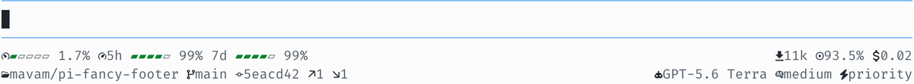
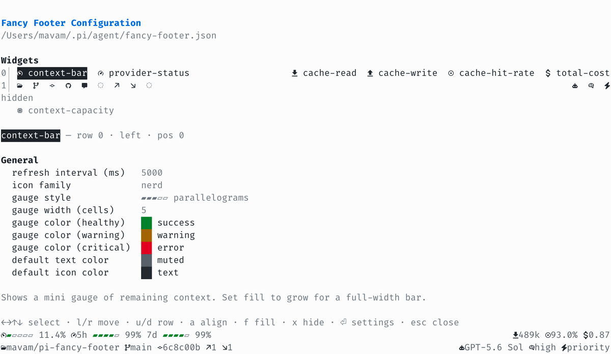

# ✨ pi-fancy-footer

A [pi](https://github.com/earendil-works/pi-mono/tree/main/packages/coding-agent)
extension that replaces the default footer with a compact, two-line fancy status
footer.

<!-- markdownlint-disable MD033 -->

<picture>
  <source media="(prefers-color-scheme: dark)" srcset="screenshots/editor-dark.png">
  <source media="(prefers-color-scheme: light)" srcset="screenshots/editor-light.png">
  
</picture>

<!-- markdownlint-enable MD033 -->

## 🚀 Installation

```sh
pi install npm:pi-fancy-footer
```

## 📊 What it shows

- Active model + thinking level
- Provider quota status for OpenAI Codex and Claude models
- A mini gauge of remaining context, which can optionally grow into a
  full-width bar, plus an optional context-capacity widget (hidden by
  default)
- Total session cost
- Prompt-cache statistics: cumulative cache-read/write tokens and the latest
  turn's cache hit rate
- Repo / path, branch, commit, open PR number, unresolved PR review
  threads, and PR CI status
- Git diff stats and ahead/behind status

## 📸 Configuration editor

<!-- markdownlint-disable MD033 -->

<picture>
  <source media="(prefers-color-scheme: dark)" srcset="screenshots/config-dark.png">
  <source media="(prefers-color-scheme: light)" srcset="screenshots/config-light.png">
  
</picture>

<!-- markdownlint-enable MD033 -->

## 🎮 Commands

- `/fancy-footer` - open interactive footer config editor (small TUI)
  - widgets appear as a micro-view of the footer: same rows, alignment
    groups, and ordering as the real footer, which updates live below
  - use `←→↑↓` to select a widget (shown inverted), then:
    - `l`/`r` - move it left/right; at a group edge it flows into the
      adjacent alignment group (left ↔ middle ↔ right)
    - `u`/`d` - move it up/down a row; `d` on the bottom row hides it into
      the `hidden` strip, `u` from there brings it back
    - `a` - cycle alignment (left → middle → right)
    - `f` - toggle fill (`none` ↔ `grow`)
    - `x` or Space - toggle visibility
    - Enter - open widget-specific settings (visibility, icon, icon color,
      text color, min width)
  - arrow down past the widgets to reach the General settings (refresh,
    icon family, gauge style/width/colors, default colors); Enter/Space
    cycles values

## ⚙️ Configuration

Create `~/.pi/agent/fancy-footer.json`:

```json
{
  "refreshMs": 3000,
  "iconFamily": "unicode",
  "gaugeStyle": "blocks",
  "gaugeWidth": 5,
  "gaugeColors": {
    "ok": "accent",
    "warning": "warning",
    "error": "error"
  },
  "defaultTextColor": "dim",
  "defaultIconColor": "text",
  "providerStatus": {
    "refreshMs": 60000,
    "cacheTtlMs": 60000,
    "providers": ["openai-codex", "anthropic"],
    "display": "gauge",
    "showCredits": false,
    "showReset": false
  },
  "widgets": {
    "context-bar": {
      "align": "left",
      "row": 0,
      "position": 0,
      "fill": "grow"
    },
    "total-cost": {
      "enabled": false
    },
    "branch": {
      "icon": "hide",
      "textColor": "muted"
    }
  },
  "extensionWidgets": {
    "acme.build-status": {
      "row": 1,
      "position": 8,
      "align": "right"
    }
  }
}
```

Top-level settings:

> [!NOTE]
> `fancy-footer.json` is validated strictly. Use only the documented keys and values.
> Invalid config falls back to defaults and logs a warning.

- `refreshMs` (number)
- `iconFamily`
  (`nerd` | `emoji` | `unicode` | `ascii`)
- `gaugeStyle`
  (`blocks` | `lines` | `circles` | `parallelograms` | `diamonds` | `bars` |
  `stars` | `specks`)
- `gaugeWidth` - cells spanned by the provider status gauges and the compact
  context gauge (3-40, default 5); a context bar with `fill` set to `grow`
  spans the row instead
- `gaugeColors` - fill colors per gauge severity; each of `ok`, `warning`,
  and `error` accepts a widget color. Defaults to `accent` / `warning` /
  `error`, so healthy gauges blend into the theme and only stand out when
  running low
- `defaultTextColor`
  (`text` | `accent` | `muted` | `dim` | `success` | `error` | `warning`)
- `defaultIconColor`
  (`text` | `accent` | `muted` | `dim` | `success` | `error` | `warning`)
- `providerStatus`:
  - `refreshMs` - provider status refresh interval in milliseconds
  - `cacheTtlMs` - cache freshness window in milliseconds
  - `providers` - supported provider adapters (`openai-codex`, `anthropic`)
  - `display` - render quota windows as a mini `gauge` (default) or plain
    `text`
  - `showCredits` - include provider-specific credit balance when available
  - `showReset` - include the primary reset time when available

Supported per-widget overrides for both `widgets` and `extensionWidgets`:

- `enabled` (boolean)
- `row` (number)
- `position` (number, ordering within an aligned row group)
- `align` (`left` | `middle` | `right`)
- `fill` (`none` | `grow`)
- `minWidth` (number)
- `icon` (`default` | `hide`)
- `iconColor`
  (`text` | `accent` | `muted` | `dim` | `success` | `error` | `warning`)
- `textColor`
  (`text` | `accent` | `muted` | `dim` | `success` | `error` | `warning`)

Built-in widget IDs:

- `model`
- `thinking`
- `context-capacity`
- `context-bar`
- `total-cost`
- `cache-read`
- `cache-write`
- `cache-hit-rate`
- `location`
- `branch`
- `commit`
- `pull-request`
- `pull-request-review-threads`
- `pull-request-ci-status`
- `provider-status`
- `diff-added`
- `diff-removed`
- `git-status`

3rd-party widget IDs are extension-defined and live under `extensionWidgets`.

## 🧩 Extension widgets

Other pi extensions can contribute fancy-footer widgets.

### For users

- Contributed widgets appear alongside built-in widgets in the `/fancy-footer` micro-view.
- Their overrides are stored in `extensionWidgets` inside `~/.pi/agent/fancy-footer.json`.
- They use the same layout controls as built-in widgets, so you can mix and match them on any footer row.

### For extension developers

If your extension depends on `pi-fancy-footer`, import the helper API from `pi-fancy-footer/api`:

```ts
import type { ExtensionAPI } from "@earendil-works/pi-coding-agent";
import { contributeFancyFooterWidgets } from "pi-fancy-footer/api";

export default function (pi: ExtensionAPI) {
  contributeFancyFooterWidgets(pi, {
    id: "acme.build-status",
    label: "Build status",
    icon: {
      nerd: "󰙨",
      emoji: "🧪",
      unicode: "◈",
      ascii: "B",
    },
    row: 1,
    order: 8,
    align: "right",
    render: () => "passing",
  });
}
```

Available helpers:

- `defineFancyFooterWidget(widget)` - identity helper for typing widget definitions.
- `contributeFancyFooterWidgets(pi, widgetOrWidgets)` - register one or more widgets for discovery.
- `requestFancyFooterWidgetDiscovery(pi)` - ask `pi-fancy-footer` to re-discover contributed widgets.
- `requestFancyFooterRefresh(pi)` - ask the footer to re-render immediately.

Each contributed widget defines:

- `id` - stable config key, ideally namespaced like `vendor.widget-name`
- `render(ctx, availableWidth?)` - widget renderer; return `undefined`, `null`, `false`, or an empty string to hide the widget
- `label` - display name in `/fancy-footer` (defaults to `id`)
- `description` - help text in the config UI (defaults to `label`/`id`)
- `row`, `order`, `align`, `grow`, and `minWidth` - optional default layout controls
- `icon` - a single icon, per-family icon map, function, or `false`/omitted
  to render without a leading icon
- optional `textColor` and `styled`

## 🔣 Icon families

The following table shows the symbol used by each widget for each icon family.
For `git-status`, the table shows the rendered status symbols rather than a
leading widget icon.

> [!NOTE]
> Some glyphs, especially in the `nerd` family, may not render in your browser.
> If a cell looks blank or shows a replacement box, check the table in a
> terminal with the relevant font installed.

<!-- markdownlint-disable MD013 MD060 -->

| Widget                        | nerd    | emoji      | unicode | ascii    |
| ----------------------------- | ------- | ---------- | ------- | -------- |
| `context-bar`                 | `󰾆`     | `🔋`       | `◧`     | `\|`     |
| `context-capacity`            | ``     | `💾`       | `□`     | `[]`     |
| `provider-status`             | `󰓅`     | `📊`       | `%`     | `%`      |
| `cache-read`                  | `󰇚`     | `📥`       | `↧`     | `R`      |
| `cache-write`                 | `󰕒`     | `📤`       | `↥`     | `W`      |
| `cache-hit-rate`              | `󰀚`     | `🎯`       | `◎`     | `H`      |
| `total-cost`                  | `󰇁`     | `💲`       | `$`     | `$`      |
| `location`                    | ``     | `📁`       | `⌂`     | `/`      |
| `branch`                      | ``     | `🌿`       | `⎇`     | `*`      |
| `commit`                      | ``     | `🔖`       | `#`     | `#`      |
| `pull-request`                | ``     | `🔀`       | `⇄`     | `@`      |
| `pull-request-review-threads` | `󰅺`     | `💬`       | `✎`     | `!`      |
| `pull-request-ci-status`      | `//` | `⏳/❌/✅` | `◷/✕/✓` | `~/x/+`  |
| `diff-added`                  | `↗`     | `➕`       | `+`     | `+`      |
| `diff-removed`                | `↘`     | `➖`       | `−`     | `-`      |
| `git-status`                  | `//` | `🔼/🔽/🔀` | `↑/↓/↕` | `^/_/<>` |
| `model`                       | `󰚩`     | `🤖`       | `◉`     | `%`      |
| `thinking`                    | `󰧑`     | `🧠`       | `✦`     | `?`      |

<!-- markdownlint-enable MD013 MD060 -->

Notes:

- Most widgets use a leading icon.
- `context-bar` renders a battery-style mini gauge of remaining context,
  e.g. `■■■□□ 55%`, spanning `gaugeWidth` cells with the glyphs from
  `gaugeStyle` (not `iconFamily`). Filled cells show the remaining share,
  colored via `gaugeColors` by how close the context is to exhaustion; empty
  cells stay dim. It sits on the left of the top row by default, with provider quota
  gauges on the right. Set the widget's `fill` to `grow` (via `/fancy-footer`
  or the config file) to expand it into a full-width bar with the used tokens
  in front, e.g. `246k ██████████░░░`.
- `context-capacity` shows the total context window in compact SI form
  (`200k`, `1M`). It is hidden by default since the context bar already
  conveys usage; enable it via `/fancy-footer` (it starts in the `hidden`
  strip) or with `"context-capacity": { "enabled": true }`. It then sits
  between the context bar and the provider quota gauges.
- `cache-read` and `cache-write` show cumulative prompt-cache tokens for the
  session in compact form (e.g. `246k`, `1.2M`). `cache-hit-rate` shows the
  latest turn's cache hit rate, computed as
  `cacheRead / (input + cacheRead + cacheWrite)`, matching the `R` / `W` /
  `CH` stats in pi's built-in footer. All three sit on the right of the top
  row by default, before `total-cost` (which stays rightmost), and hide when
  the session has no cache activity or the terminal is narrower than 60
  columns.
- `git-status` uses symbols for ahead / behind / diverged status.
- `pull-request-ci-status` is icon-only and uses symbols for running / failed /
  okay status. By default it uses semantic colors (warning / error / success);
  set this widget's icon color to override them.
- `provider-status` shows provider quota windows for OpenAI Codex and Claude
  models as battery-style mini gauges per window, e.g.
  `5h ▰▰▰▰▱ 80% 7d ▰▰▱▱▱ 38%`,
  where filled cells show the remaining quota and each window is colored by
  how close it is to exhaustion. The gauge spans `gaugeWidth` cells and
  reuses the configured `gaugeStyle` glyphs; set `providerStatus.display` to
  `text` for the
  compact `5h:95% 7d:97%` form. Codex uses existing pi OpenAI Codex credentials
  from `~/.pi/agent/auth.json`, falling back to Codex CLI credentials in
  `~/.codex/auth.json`. Claude uses pi Anthropic OAuth credentials from
  `~/.pi/agent/auth.json` and reads Claude.ai usage for the 5-hour and weekly
  windows. Status is cached under `~/.cache/pi-fancy-footer/provider-status/`;
  when a refresh fails, cached quota windows keep showing until their reset times
  pass instead of hiding the widget. The widget is hidden when the active model
  selection is not backed by the status provider.
- `provider-status` also refreshes from `x-codex-*` provider response headers
  when pi exposes them, avoiding a separate Codex status request after provider
  calls. Claude status refreshes from the Claude.ai usage endpoint, not
  provider response headers.
- `iconFamily` lets you choose between `nerd`, `emoji`, `unicode`, and
  `ascii` palettes.
- `nerd` keeps the original Nerd Font look. `emoji`, `unicode`, and `ascii`
  work better in terminals that don't use a Nerd Font.
- Per-widget icon overrides only let you hide the icon. The selected
  `iconFamily` controls which icon each widget uses.
- The PR widgets appear only for open GitHub and GitHub Enterprise pull
  requests on GitHub-style hosts such as `github.example.com`; they rely on the
  GitHub CLI (`gh`) being available and authenticated for the remote host.
- `pull-request-review-threads` counts unresolved GitHub review threads
  on the current PR.
- `pull-request-ci-status` shows GitHub Actions workflow runs for the current
  PR head commit. It links to the relevant run and switches to failed as soon as
  one workflow fails, even when other workflows are still running.

## 🧱 Gauge styles

The `gaugeStyle` setting controls the characters used by the `context-bar`
and `provider-status` gauges. Each style defines symbols for filled and empty
cells:

<!-- markdownlint-disable MD013 MD060 -->

| Style              | Filled | Empty |
| ------------------ | ------ | ----- |
| `blocks` (default) | `■`    | `□`   |
| `lines`            | `━`    | `─`   |
| `circles`          | `●`    | `○`   |
| `parallelograms`   | `▰`    | `▱`   |
| `diamonds`         | `◆`    | `◇`   |
| `bars`             | `█`    | `░`   |
| `stars`            | `★`    | `☆`   |
| `specks`           | `•`    | `◦`   |

<!-- markdownlint-enable MD013 MD060 -->

## 🧹 Uninstall

```sh
pi remove npm:pi-fancy-footer
```

## 📄 License

[MIT](LICENSE)
