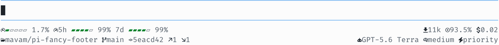
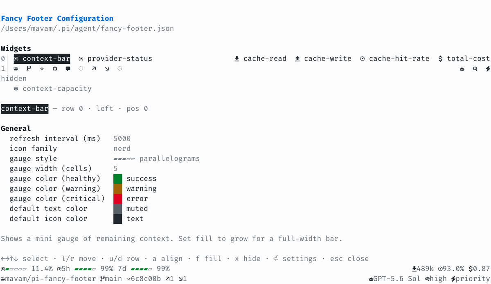

# ✨ pi-fancy-footer

A [pi](https://github.com/earendil-works/pi-mono/tree/main/packages/coding-agent)
extension that replaces the default footer with a compact, two-line fancy status
footer.

<!-- markdownlint-disable MD033 -->

<picture>
  <source media="(prefers-color-scheme: dark)" srcset="screenshots/editor-dark.png">
  <source media="(prefers-color-scheme: light)" srcset="screenshots/editor-light.png">
  
</picture>

<!-- markdownlint-enable MD033 -->

## 🚀 Installation

```sh
pi install npm:pi-fancy-footer
```

## 📊 What it shows

- Active model + thinking level, plus the model's provider (hidden by default)
- Provider quota status for OpenAI Codex and Claude models
- A mini gauge of used context, which can optionally grow into a
  full-width bar, plus an optional context-capacity widget (hidden by
  default)
- Total session cost
- Prompt-cache statistics: cumulative cache-read/write tokens and the latest
  turn's cache hit rate
- Repo / path, branch, optional commit SHA (hidden by default), open or merged
  PR number, auto-merge status, unresolved PR review threads, and PR CI status
- Git diff stats and ahead/behind status

## 📸 Configuration editor

<!-- markdownlint-disable MD033 -->

<picture>
  <source media="(prefers-color-scheme: dark)" srcset="screenshots/config-dark.png">
  <source media="(prefers-color-scheme: light)" srcset="screenshots/config-light.png">
  
</picture>

<!-- markdownlint-enable MD033 -->

## 🎮 Commands

- `/fancy-footer` - open interactive footer config editor (small TUI)
  - widgets appear as a micro-view of the footer: same rows, alignment
    groups, and ordering as the real footer, which updates live below
  - use `←→↑↓` to select a widget (shown inverted), then:
    - `l`/`r` - move it left/right; at a group edge it flows into the
      adjacent alignment group (left ↔ middle ↔ right)
    - `u`/`d` - move it up/down a row; `d` on the bottom row hides it into
      the `hidden` strip, `u` from there brings it back
    - `a` - cycle alignment (left → middle → right)
    - `f` - toggle fill (`none` ↔ `grow`)
    - `x` or Space - toggle visibility
    - Enter - open widget-specific settings (visibility, icon, icon color,
      text color, min width, and the provider-status reset threshold)
  - arrow down past the widgets to reach the General settings (refresh,
    icon family, gauge style/width/colors, default colors); Enter/Space
    cycles values

## ⚙️ Configuration

Create `~/.pi/agent/fancy-footer.json`:

```json
{
  "refreshMs": 3000,
  "iconFamily": "unicode",
  "gaugeStyle": "blocks",
  "gaugeWidth": 5,
  "gaugeColors": {
    "ok": "accent",
    "warning": "warning",
    "error": "error"
  },
  "defaultTextColor": "dim",
  "defaultIconColor": "text",
  "providerStatus": {
    "refreshMs": 60000,
    "cacheTtlMs": 60000,
    "providers": ["openai-codex", "anthropic"],
    "display": "gauge",
    "showCredits": false,
    "showReset": "all",
    "resetMinUsedPercent": 75
  },
  "widgets": {
    "context-bar": {
      "align": "left",
      "row": 0,
      "position": 0,
      "fill": "grow"
    },
    "total-cost": {
      "enabled": false
    },
    "commit": {
      "enabled": true
    },
    "branch": {
      "icon": "hide",
      "textColor": "muted"
    }
  },
  "extensionWidgets": {
    "acme.build-status": {
      "row": 1,
      "position": 8,
      "align": "right"
    }
  }
}
```

Top-level settings:

> [!NOTE]
> `fancy-footer.json` is validated strictly. Use only the documented keys and values.
> Invalid configuration falls back to defaults and logs a warning.

> [!WARNING]
> `providerStatus.showReset` no longer accepts booleans. Before upgrading,
> replace `true` with `"primary"` and `false` with `"off"`. An invalid value
> causes the entire file to fall back to defaults.

- `refreshMs` (number) - interval for background Git refreshes. Model,
  thinking-level, provider-response, and extension-widget changes update from
  events without waiting for this interval
- `iconFamily`
  (`nerd` | `emoji` | `unicode` | `ascii`)
- `gaugeStyle`
  (`blocks` | `lines` | `circles` | `parallelograms` | `diamonds` | `bars` |
  `stars` | `specks`)
- `gaugeWidth` - cells spanned by the provider status gauges and the compact
  context gauge (3-40, default 5); a context bar with `fill` set to `grow`
  spans the row instead
- `gaugeColors` - fill colors per gauge severity; each of `ok`, `warning`,
  and `error` accepts a widget color. Defaults to `accent` / `warning` /
  `error`, so healthy gauges blend into the theme and only stand out when
  running low
- `defaultTextColor`
  (`text` | `accent` | `muted` | `dim` | `success` | `error` | `warning`)
- `defaultIconColor`
  (`text` | `accent` | `muted` | `dim` | `success` | `error` | `warning`)
- `providerStatus`:
  - `refreshMs` - provider status refresh interval in milliseconds
  - `cacheTtlMs` - cache freshness window in milliseconds
  - `providers` - supported provider adapters (`openai-codex`, `anthropic`)
  - `display` - render quota windows as a mini `gauge` (default) or plain
    `text`
  - `showCredits` - include a provider-specific credit balance when available
  - `showReset` - control which relative reset countdowns are eligible:
    - `"off"` - hide all countdowns
    - `"primary"` - show the primary window countdown
    - `"all"` - show every reported window countdown (default)
  - `resetMinUsedPercent` - show an eligible countdown once its window reaches
    this used quota percentage (0-100, default 75). The comparison is inclusive
    and uses the displayed percentage. A window without a reported usage value
    counts as 0%. Set this to `0` to always show eligible countdowns.

Supported per-widget overrides for both `widgets` and `extensionWidgets`:

- `enabled` (boolean)
- `row` (number)
- `position` (number, ordering within an aligned row group)
- `align` (`left` | `middle` | `right`)
- `fill` (`none` | `grow`)
- `minWidth` (number)
- `icon` (`default` | `hide`)
- `iconColor`
  (`text` | `accent` | `muted` | `dim` | `success` | `error` | `warning`)
- `textColor`
  (`text` | `accent` | `muted` | `dim` | `success` | `error` | `warning`)

Built-in widget IDs:

- `provider`
- `model`
- `thinking`
- `context-capacity`
- `context-bar`
- `total-cost`
- `cache-read`
- `cache-write`
- `cache-hit-rate`
- `location`
- `branch`
- `commit`
- `pull-request`
- `pull-request-review-threads`
- `pull-request-ci-status`
- `provider-status`
- `diff-added`
- `diff-removed`
- `git-status`

3rd-party widget IDs are extension-defined and live under `extensionWidgets`.

## 🧩 Extension widgets

Other pi extensions can contribute fancy-footer widgets.

### For users

- Contributed widgets appear alongside built-in widgets in the `/fancy-footer` micro-view.
- Their overrides are stored in `extensionWidgets` inside `~/.pi/agent/fancy-footer.json`.
- They use the same layout controls as built-in widgets, so you can mix and match them on any footer row.

### For extension developers

Publish complete widget snapshots over pi's in-process event bus. Producers do
not need to depend on `pi-fancy-footer`:

```ts
import type { ExtensionAPI } from "@earendil-works/pi-coding-agent";

const protocol = 1;
const widgetChannel = "pi-fancy-footer:widget";
const readyChannel = "pi-fancy-footer:ready";

export default function (pi: ExtensionAPI) {
  let status = "passing";

  const publish = () => {
    pi.events.emit(widgetChannel, {
      protocol,
      type: "upsert",
      widget: {
        id: "acme.build-status",
        label: "Build status",
        description: "Current build result",
        content: { type: "text", text: status },
        icon: {
          glyphs: {
            nerd: "󰙨",
            emoji: "🧪",
            unicode: "◈",
            ascii: "B",
          },
          color: "success",
        },
        style: { textColor: "success" },
        layout: { row: 1, position: 8, align: "right" },
      },
    });
  };

  const stopReady = pi.events.on(readyChannel, (message) => {
    if (
      typeof message === "object" &&
      message !== null &&
      "protocol" in message &&
      message.protocol === protocol
    ) {
      publish();
    }
  });

  // Publish once for a footer that is already listening. Publish again when
  // state changes; the footer does not poll producers.
  publish();

  pi.on("session_shutdown", () => {
    stopReady();
    pi.events.emit(widgetChannel, {
      protocol,
      type: "remove",
      id: "acme.build-status",
    });
  });
}
```

The protocol uses these channels:

- `pi-fancy-footer:widget` accepts protocol-1 `upsert` and `remove` messages.
- `pi-fancy-footer:ready` announces that the footer is listening. Producers
  should republish their current snapshot when they receive it.

Each `upsert` replaces the complete snapshot for its `id`; the latest command
wins if multiple producers use the same ID. IDs must be at most 128 ASCII
characters and contain two or more dot-separated segments. Each segment starts
with a letter or digit and may also contain letters, digits, underscores, and
hyphens, for example `acme.build-status`. An empty `content.text` hides the
widget while keeping it configurable, even when the widget is explicitly
enabled. A `remove` message drops the live widget definition. Widget text is
limited to 512 Unicode code points and terminal control characters are stripped.

The structured snapshot can provide `label`, `description`, an icon glyph or
per-family glyph map, icon and text colors, and layout defaults (`enabled`,
`row`, `position`, `align`, `fill`, and `minWidth`). Saved user settings override
event-provided defaults. Use `layout.enabled: false` for an opt-in widget.

Extensions that already depend on this package may use
`createFancyFooterClient` from `pi-fancy-footer/api` for typed `upsert`,
`remove`, and `onReady` helpers. It speaks the same event protocol.

## 🔣 Icon families

The following table shows the symbol used by each widget for each icon family.
For `git-status`, the table shows the rendered status symbols rather than a
leading widget icon.

> [!NOTE]
> Some glyphs, especially in the `nerd` family, may not render in your browser.
> If a cell looks blank or shows a replacement box, check the table in a
> terminal with the relevant font installed.

<!-- markdownlint-disable MD013 MD060 -->

| Widget                        | nerd    | emoji      | unicode | ascii    |
| ----------------------------- | ------- | ---------- | ------- | -------- |
| `context-bar`                 | `󰾆`     | `🔋`       | `◧`     | `\|`     |
| `context-capacity`            | ``     | `💾`       | `□`     | `[]`     |
| `provider-status`             | `󰓅`     | `📊`       | `%`     | `%`      |
| `cache-read`                  | `󰇚`     | `📥`       | `↧`     | `R`      |
| `cache-write`                 | `󰕒`     | `📤`       | `↥`     | `W`      |
| `cache-hit-rate`              | `󰀚`     | `🎯`       | `◎`     | `H`      |
| `total-cost`                  | `󰇁`     | `💲`       | `$`     | `$`      |
| `location`                    | ``     | `📁`       | `⌂`     | `/`      |
| `branch`                      | ``     | `🌿`       | `⎇`     | `*`      |
| `commit`                      | ``     | `🔖`       | `#`     | `#`      |
| `pull-request`                | ``     | `🔀`       | `⇄`     | `@`      |
| `pull-request-review-threads` | `󰅺`     | `💬`       | `✎`     | `!`      |
| `pull-request-ci-status`      | `//` | `⏳/❌/✅` | `◷/✕/✓` | `~/x/+`  |
| `diff-added`                  | `↗`     | `➕`       | `+`     | `+`      |
| `diff-removed`                | `↘`     | `➖`       | `−`     | `-`      |
| `git-status`                  | `//` | `🔼/🔽/🔀` | `↑/↓/↕` | `^/_/<>` |
| `provider`                    | `󰅟`     | `☁️`       | `☁`     | `&`      |
| `model`                       | `󰚩`     | `🤖`       | `◉`     | `%`      |
| `thinking`                    | `󰧑`     | `🧠`       | `✦`     | `?`      |

<!-- markdownlint-enable MD013 MD060 -->

Notes:

- Most widgets use a leading icon.
- `context-bar` renders a mini gauge of used context,
  e.g. `■■□□□ 40%`, spanning `gaugeWidth` cells with the glyphs from
  `gaugeStyle` (not `iconFamily`). Filled cells and the percentage show the
  consumed share and fill up from the left, colored via `gaugeColors` by how
  close the context is to exhaustion; empty cells stay dim. It sits on the
  left of the top row by default, with provider quota gauges beside it. Set the widget's `fill` to
  `grow` (via `/fancy-footer` or the configuration file) to expand it into a
  full-width bar with the used tokens in front, e.g. `246k ██████████░░░`.
  Immediately after compaction, the gauge resets to empty (`0%`) while Pi waits
  for the next model response to report post-compaction usage.
- `context-capacity` shows the total context window in compact SI form
  (`200k`, `1M`). It is hidden by default since the context bar already
  conveys usage; enable it via `/fancy-footer` (it starts in the `hidden`
  strip) or with `"context-capacity": { "enabled": true }`. It then sits
  between the context bar and the provider quota gauges.
- `commit` shows the short Git commit SHA. It is hidden by default; enable it
  via `/fancy-footer` or with `"commit": { "enabled": true }`.
- `provider` shows the display name of the active model's provider
  (`Anthropic`, `OpenAI Codex`, …), which the model name alone does not reveal.
  Providers defined only in `models.json` fall back to their id. The widget is
  hidden by default; enable it via `/fancy-footer` or with
  `"provider": { "enabled": true }`. It then sits left of the model on the
  bottom row.
- `cache-read` and `cache-write` show cumulative prompt-cache tokens for the
  session in compact form (e.g. `246k`, `1.2M`). `cache-hit-rate` shows the
  latest turn's cache hit rate, computed as
  `cacheRead / (input + cacheRead + cacheWrite)`, matching the `R` / `W` /
  `CH` stats in pi's built-in footer. All three sit on the right of the top
  row by default, before `total-cost` (which stays rightmost), and hide when
  the session has no cache activity or the terminal is narrower than 60
  columns.
- `git-status` uses symbols for ahead / behind / diverged status.
- `pull-request` keeps merged PRs visible. A non-default icon color override
  always takes precedence. Otherwise, the PR icon uses a fixed GitHub purple
  (`#8250df`, with a 256-color fallback) for merged PRs, the theme's dim color
  for draft PRs, the accent color when auto-merge is enabled, and the configured
  icon color for other open PRs. The purple is deliberately theme-independent.
- `pull-request-ci-status` is icon-only and uses symbols for running / failed /
  okay status. By default it uses semantic colors (warning / error / success);
  set this widget's icon color to override them.
- `provider-status` shows provider quota windows for OpenAI Codex and Claude
  models as mini gauges per window, for example
  `5h ▰▰▰▰▱ 80% ~1h12m 7d ▰▰▱▱▱ 38%`.
  Filled cells show the used quota, growing from the left like the context bar,
  and each window is colored by how close it is to exhaustion. In gauge mode,
  a dim reset countdown belongs to the window immediately before it. The
  default `resetMinUsedPercent: 75` shows a countdown only when that window is
  at least 75% used. The default `showReset: "all"` makes every reported window
  eligible; use `"primary"` to allow only the primary window or `"off"` to hide
  countdowns. You can change the threshold in the `provider-status` widget's
  interactive settings. Set it to `0` to restore the previous always-show
  behavior.
  The gauge spans `gaugeWidth` cells and reuses the configured `gaugeStyle`
  glyphs. Set `providerStatus.display` to `text` for the compact
  `5h:80% ~1h12m 7d:38%` form. Text mode keeps the existing provider severity
  color for the whole widget. Countdown placement, thresholds, and modes apply
  to Claude and Codex in both display styles.
  The widget renders only the windows that the provider reports. If Codex omits
  its 5-hour window and promotes the weekly window to primary, the footer
  removes the stale 5-hour value and shows only `7d`. Because that weekly
  window is primary, it receives a countdown under the default mode. In an
  output such as `󰾆▱▱▱▱▱ 0% 󰓅7d ▰▰▰▰▱ 84% ~1d7h`, `0%` is the share of pi's
  context window in use and `84%` is the used weekly Codex quota. Codex uses
  existing pi OpenAI Codex credentials from `~/.pi/agent/auth.json`, falling
  back to Codex CLI credentials in `~/.codex/auth.json`. Claude uses pi
  Anthropic OAuth credentials from
  `~/.pi/agent/auth.json` and reads Claude.ai usage for the 5-hour and weekly
  windows. When Claude reports a limit that applies only to the active model,
  such as the weekly Fable cap, that window replaces the account-wide window
  with the same label instead of adding a gauge, so `7d` shows the quota that
  actually limits the current model. The stricter of the two always wins,
  because whichever runs out first ends the session, and the value follows
  `/model` switches without another usage request.
  Status is cached under `~/.cache/pi-fancy-footer/provider-status/`;
  when a refresh fails, cached quota windows keep showing until their reset times
  pass instead of hiding the widget. Once a window passes its reset time it stays
  visible with unknown usage (`—`) until a refresh reports the new period, so a
  quota rollover neither hides the gauge nor claims unconfirmed headroom. The
  widget is hidden when the active model selection is not backed by the status
  provider.
- `provider-status` also refreshes from `x-codex-*` provider response headers
  when pi exposes them, avoiding a separate Codex status request after provider
  calls. Claude status refreshes from the Claude.ai usage endpoint, not
  provider response headers.
- `iconFamily` lets you choose between `nerd`, `emoji`, `unicode`, and
  `ascii` palettes.
- `nerd` keeps the original Nerd Font look. `emoji`, `unicode`, and `ascii`
  work better in terminals that don't use a Nerd Font.
- Per-widget icon overrides only let you hide the icon. The selected
  `iconFamily` controls which icon each widget uses.
- The PR widgets appear only for open or merged pull requests on GitHub and
  GitHub Enterprise hosts such as `github.example.com`. The footer also detects
  auto-merge on open PRs. These widgets rely on the GitHub CLI (`gh`) being
  available and authenticated for the remote host.
- `pull-request-review-threads` counts unresolved GitHub review threads
  on the current PR.
- `pull-request-ci-status` summarizes the checks that GitHub reports for the
  current pull request. It links to a relevant check and shows failed when any
  check fails, running when none fail but at least one is active, and okay
  otherwise.

## 🧱 Gauge styles

The `gaugeStyle` setting controls the characters used by the `context-bar`
and `provider-status` gauges. All gauges fill from the left with what is
already consumed, so a nearly full gauge means a nearly exhausted resource.
Each style defines symbols for filled and empty cells:

<!-- markdownlint-disable MD013 MD060 -->

| Style              | Filled | Empty |
| ------------------ | ------ | ----- |
| `blocks` (default) | `■`    | `□`   |
| `lines`            | `━`    | `─`   |
| `circles`          | `●`    | `○`   |
| `parallelograms`   | `▰`    | `▱`   |
| `diamonds`         | `◆`    | `◇`   |
| `bars`             | `█`    | `░`   |
| `stars`            | `★`    | `☆`   |
| `specks`           | `•`    | `◦`   |

<!-- markdownlint-enable MD013 MD060 -->

## 📄 License

[MIT](LICENSE)
